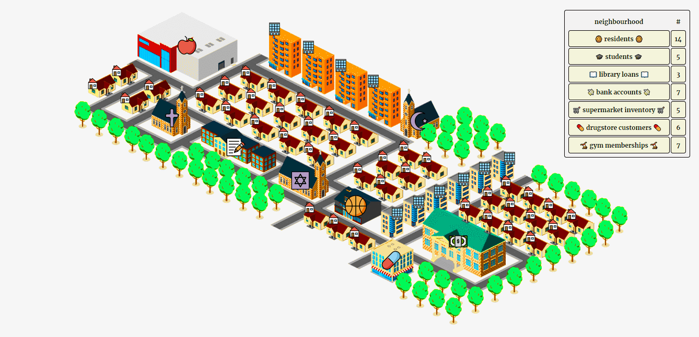

# Neighborhood
Neighborhood is a database management system, built with Django. It has a user-friendly interface for basic CRUD operations. Its purpose is to provide broad management of several databases in a neighborhood scenario.

## Default interface
The default interface consists of a [neighborhood map](https://icograms.com) with a school, a drugstore, three religious sites, a bank, houses, apartments, a gym, and a supermarket. Each of these entities represents a potential use case for a database system.

The following databases and tables were created on PostgreSQL:

| Databases | Tables |
|------|-----|
|Supermarket| Inventory, Employees, Functions, Shifts  |
| Residence| Apartments, Houses, Residents  |
| Prayer| Places of worship |
| Gym| Customers, Shifts, Staff |
| Drugstore| Customers, Prescriptions, Storage, Suppliers|
| School| Students, Teachers, Courses, Enrollments, Library Books, Library Members, Library Loans|
| Bank| Customers, Accounts |

Each table has particular attributes, some of which are shared. For instance, to add a loan to the School.Library_Loans, the user has to input a Member ID (a Foreign Key relating to School.Library_Members) and a Book ID (another Foreign Key, relating to School.Library_Books).

While users are encouraged to create their own databases, backups with pre-existing data are available in the **/db** folder. If desired, users can also use the **clean_tables.SQL** file in the same folder to clear the data.

When an area is clicked on, a particular popup is triggered. The popups have buttons on top for switching between tables of the same database. They also have: a specific form with the proper attributes of the current table as input fields, submit and close buttons, and links for performing CRUD operations (ADD for insert, READ for read, EDIT for update, and DELETE for delete).

If the user desires to add a customer to the customers table of the Bank database, they should input the name, age, address, and phone and click 'submit'. To edit a customer, users need to input the ID of the specific customer and all the desired attribute changes. To delete the customer, only the ID is needed. To see all the customers, the user can click on 'read', and a table will be generated on another tab.

Users should be aware that if a table has a Foreign Key, they will need to submit forms for the related tables before adding data. For instance, the Library Loans (from the School database) needs two Foreign Keys as attributes: the Library Member ID and the Book ID. Therefore, before adding a Library Loan, users should submit forms for the Library Member and Library Book tables.

In addition to the map, there is a table in the top-right corner that displays database data. This table is automatically generated to provide a general view of the neighborhood and can be customized in the index.html file.
 
 ## Setting your own system
The first step to set up your system is creating a map with clickable areas for the desired entities. Then, the databases can be created in PostgreSQL and imported in the **settings.py** with the correct attributes. After that, it is necessary to create your models in **myapp/models.py**. Import the model into **myapp/urls.py**, and and configure the popup in index.html using the available JavaScript scripts in the **static/script** folder.

